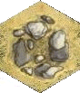

# pyHexBattle

# BattleCry Notes

These notes assume you have already read the main `README` file.

## A BattleCry Scenario File

The XML files that store the scenarios are the heart of **pyHexBattle**. An example scenario file looks this:

    <?xml version="1.0"?>
    <hbml:hexbattle 
      id="franklin" 
      type="battlecry" 
      version="1.0" 
      xmlns:hbml="http://github.com/gamesbook/pyHexBattle/">
      <hbml:meta>
        <hbml:designer>
          <hbml:name>David Vander Ark</hbml:name>
          <hbml:email></hbml:email>
        </hbml:designer>
        <hbml:version>1</hbml:version>
      </hbml:meta>
      <hbml:scenario>
        <hbml:name abpp="tn036" acc="tn/tn016"  oob="">Franklin</hbml:name>
        <hbml:alternate></hbml:alternate>
        <hbml:title></hbml:title>
        <hbml:date year="1864" month="04" day="30">30th November, 1864</hbml:date>
        <hbml:period></hbml:period>
        <hbml:location>
          <hbml:country>USA</hbml:country>
          <hbml:state code="tn">Tennessee</hbml:state>
        </hbml:location>
        <hbml:description>Franklin scenario recreates the Confederate assault on 
          Union entrenchments at Franklin. </hbml:description>      
      </hbml:scenario>
      <hbml:terrain>
        <hbml:hex row="1" col="10" type="terrain" style="woods"></hbml:hex>
        <hbml:hex row="1" col="11" type="terrain" style="woods"></hbml:hex>
        <hbml:hex row="4" col="7" type="terrain" style="woods"></hbml:hex>    
        <hbml:hex row="7" col="12" type="terrain" style="woods"></hbml:hex>
        <hbml:hex row="4" col="5" type="terrain" style="buildings">Carter House</hbml:hex>
        <hbml:hex row="5" col="9" type="terrain" style="buildings">Gin House</hbml:hex>
        <hbml:hex row="4" col="7" type="terrain" style="orchard"></hbml:hex>
        <hbml:hex row="3" col="11" type="terrain" style="fence_one" face="3"></hbml:hex>
        <hbml:hex row="3" col="12" type="terrain" style="fence_two" face="4"></hbml:hex>
        <hbml:hex row="4" col="10" type="terrain" style="fence_two" face="3"></hbml:hex>
        <hbml:hex row="5" col="10" type="terrain" style="fence_two" face="3"></hbml:hex>
        <hbml:hex row="1" col="12" type="terrain" style="river_straight" face="3"></hbml:hex>
        <hbml:hex row="2" col="12" type="terrain" style="river_straight" face="3"></hbml:hex> 
        <hbml:hex row="3" col="13" type="terrain" style="river_curve" face="5"></hbml:hex>   
        <hbml:hex row="4" col="12" type="terrain" style="river_curve" face="2"></hbml:hex>
        <hbml:hex row="5" col="13" type="terrain" style="river_curve" face="1"></hbml:hex>    
      </hbml:terrain>
      <hbml:forces>
        <hbml:force id="u" type="union" name="Union">
          <hbml:commander>John M. Schofield</hbml:commander>
          <hbml:unit id="UG01" type="general" row="4" col="6">Stanley</hbml:unit>
          <hbml:unit id="UG02" type="general" row="4" col="9">Opdyck</hbml:unit>
          <hbml:unit id="UI01" type="infantry" row="1" col="6"></hbml:unit>
          <hbml:unit id="UI02" type="infantry" row="2" col="1"></hbml:unit>
          <hbml:unit id="UI03" type="infantry" row="3" col="2"></hbml:unit>
          <hbml:unit id="UI04" type="infantry" row="3" col="4"></hbml:unit>
          <hbml:unit id="UI05" type="infantry" row="3" col="5"></hbml:unit>
          <hbml:unit id="UI06" type="infantry" row="3" col="11"></hbml:unit>
          <hbml:unit id="UI07" type="infantry" row="4" col="4"></hbml:unit>
          <hbml:unit id="UI08" type="infantry" row="4" col="10"></hbml:unit>
          <hbml:unit id="UI09" type="infantry" row="5" col="7"></hbml:unit>
          <hbml:unit id="UI10" type="infantry" row="5" col="10"></hbml:unit>
          <hbml:unit id="UA01" type="artillery" row="1" col="5"></hbml:unit>
          <hbml:special>
            <hbml:cards>5</hbml:cards>
            <hbml:instructions></hbml:instructions>
          </hbml:special>
        </hbml:force>
        <hbml:force id="c" type="confederate" name="Confederate">
          <hbml:commander>John B. Hood</hbml:commander>
          <hbml:unit id="CG01" type="general" row="7" col="11">Cheatham</hbml:unit>
          <hbml:unit id="CG02" type="general" row="8" col="1">Forrest</hbml:unit>
          <hbml:unit id="CG03" type="general" row="9" col="8">Cleburne</hbml:unit>
          <hbml:unit id="CI01" type="infantry" row="6" col="12"></hbml:unit>
          <hbml:unit id="CI02" type="infantry" row="7" col="7"></hbml:unit>
          <hbml:unit id="CI03" type="infantry" row="7" col="8"></hbml:unit>
          <hbml:unit id="CI04" type="infantry" row="7" col="11"></hbml:unit>
          <hbml:unit id="CI05" type="infantry" row="8" col="3"></hbml:unit>
          <hbml:unit id="CI06" type="infantry" row="8" col="5"></hbml:unit>
          <hbml:unit id="CI07" type="infantry" row="9" col="2"></hbml:unit>
          <hbml:unit id="CI08" type="infantry" row="9" col="6"></hbml:unit>
          <hbml:unit id="CI09" type="infantry" row="9" col="7"></hbml:unit>
          <hbml:unit id="CI10" type="infantry" row="9" col="11"></hbml:unit> 
          <hbml:unit id="CC01" type="cavalry" row="8" col="1"></hbml:unit>          
          <hbml:special>
            <hbml:cards>4</hbml:cards>
            <hbml:instructions>You move first.</hbml:instructions>
          </hbml:special>
        </hbml:force>    
      </hbml:forces>
      <hbml:notes>
        <hbml:note id="s" type="special">
          <hbml:p>None</hbml:p>
        </hbml:note>
        <hbml:note id="h" type="historical">
          <hbml:p>No summary.</hbml:p>
        </hbml:note>    
      </hbml:notes>
    </hbml:hexbattle>

A section-by-section explanation of this file now follows.

### Header Information

    <?xml version="1.0"?>
    <hbml:hexbattle 
      id="firstbullrun" 
      type="battlecry" 
      version="1.0" 
      xmlns:hbml="http://github.com/gamesbook/pyHexBattle/">

This section is the 'standard' header for an XML file - the only thing that will need to change will be the "id"; this is typically the name of the battle (in lowercase), and should be unique across all battles. For multi-day, or more complex, battles, a longer name might be required e.g. **gettysburg-pickett-1**. The `hbml:` is a prefix which appears in all subsequent tags; it is linked to a unique identifier for this type of XML file that distinguishes it from any other XML file.

### Meta Information

    <hbml:meta>
        <hbml:designer>
          <hbml:name>David Van der Ark</hbml:name>
          <hbml:email></hbml:email>
        </hbml:designer>
        <hbml:version>1</hbml:version>
    </hbml:meta>

The 'meta information' section contains information on the `<designer>` of the scenario (the person's `<name>` and `<email>`) and which `<version>` of the scenario this particular file represents.

### Scenario Information

    <hbml:scenario>
        <hbml:name abpp="tn036" acc="tn/tn016" oob="">Franklin</hbml:name>
        <hbml:alternate></hbml:alternate>
        <hbml:title></hbml:title>
        <hbml:date startyear="1864" startmonth="04" startday="30">30th November, 1864</hbml:date>
        <hbml:period></hbml:period>
        <hbml:location>
          <hbml:country>USA</hbml:country>
          <hbml:state code="tn">Tennessee</hbml:state>
        </hbml:location>
        <hbml:description>Franklin scenario recreates the Confederate assault on
          Union entrenchments at Franklin. </hbml:description>    
    </hbml:scenario>

This section contains details about the actual battle being represented. The <name> is that conventionally assigned to the battle. The "abpp" identifier refers to the key part of the web address for the ABPP ([American Battlefield Protection Program](http://www2.cr.nps.gov/abpp/index.htm)) web page. Similarly, the "acc" provides a link to the ([American Civil War](http://www.americancivilwar.com/)) web site. The "oob" provides a link to Order-of-Battle pages at the [American Civil War On Line](http://web2.iadfw.net/mbusby/) web site.

The `<alternate>` lists any other name(s) by which the battle is commonly referred to. The `<title>` is only used when a portion of the battle is being represented by the scenario (as might be the case for larger battle, such as Gettysburg). The `<date>` is when the battle was fought; this can be a single day, or a date range (e.g. 11th-12th December 1863). The `<period>` is used when only a given day of the battle is being simulated.

The `<location>` provides information on the country and state in which the battle took place. The "code" provides a link to the key code for ([American Civil War](http://www.americancivilwar.com/)) state battle map site. The `<description>` is a brief (one liner) of what the scenario portrays.

### Terrain Information

    <hbml:terrain>
        <hbml:hex row="1" col="10" type="terrain" style="woods"></hbml:hex>
        <hbml:hex row="4" col="5" type="terrain" style="buildings">Carter House</hbml:hex>
        <hbml:hex row="5" col="9" type="terrain" style="buildings">Gin House</hbml:hex>
        <hbml:hex row="4" col="7" type="terrain" style="orchard"></hbml:hex>
        <hbml:hex row="1" col="12" type="terrain" style="river_straight" face="3"></hbml:hex>
        ...
    </hbml:terrain>

This section contains a `<hex>` entry for each piece of terrain (or other map marking pertinent to the scenario) that appears on the board. Each `<hex>` entry contains:

*   **row**s are numbered from "1" to "9" (starting at the 'top' of the board)
*   **col**umns are numbered from "1" to "13" (starting at the 'left' of the board)
*   **type** is usually "terrain", but can be "special":

*   for "terrain" type hexes, a **style** property is required to identify which specific terrain is displayed and, in some cases, a **face** property as well (to indicate direction) - see the full [Terrain Tile Set](#tileset) list.
*   for "special" types of hexes, a **style** property is required to identify which type is applicable - this can either be "border" (for a border to be drawn around the hex), or "shaded", for a coloured, semi-transparent overlay to fill the hex.

In addition, the name of the terrain feature (hill, buildings, wood, river and so on), or other notation can be supplied e.g. `<hex>Carter House</hex>` for a building label, or `<hex>Union Reinforcements</hex>` for special instructions.

**Tip:** In the case where one type of terrain feature has to overlay another - such as is the case for Field-works placed on, say, a Hill - the overlying terrain `<hex>` entry should occur **after** (below) the entry for the base terrain. All "special" hexes are also usually placed at the end, as they typically provide additional annotation that must appear 'over' the underlying terrain.

### Forces Information

    <hbml:forces>
        <hbml:force id="u" type="union" name="Union">
          ...
          <hbml:special>
            <hbml:cards>5</hbml:cards>
            <hbml:instructions></hbml:instructions>
          </hbml:special>
        </hbml:force>
        <hbml:force id="c" type="confederate" name="Confederate">
          ...         
          <hbml:special>
            <hbml:cards>4</hbml:cards>
            <hbml:instructions>You move first.</hbml:instructions>
          </hbml:special>
        </hbml:force>    
    </hbml:forces>    

This section contains information on the opposing sides in the battle. There will be one `<force>` section for each side. Each `<force>` entry identifies the force:

*   **id** is a unique identifier for each force (the defaults of "u" for Union, or "c" for Confederate can be used)
*   **type** _must_ be either "union" or "confederate" (this key information is used, for example, to identify corresponding image files)
*   **name** is used for display purposes

Each section also contains detailed force information (see below) as well as `<special>` information applicable to it. This includes the number of `<cards>` available to that side, and `<instructions>`, such as who it is that starts first.

### Units Information

    <hbml:commander>John Bell Hood</hbml:commander>
    <hbml:unit id="CG01" type="general" row="7" col="11">Cheatham</hbml:unit>
    <hbml:unit id="CG02" type="general" row="8" col="1">Forrest</hbml:unit>
    <hbml:unit id="CI01" type="infantry" row="6" col="12"></hbml:unit>
    <hbml:unit id="CI02" type="infantry" row="7" col="7"></hbml:unit>
    <hbml:unit id="CC01" type="cavalry" row="8" col="1"></hbml:unit> 

This section contains the detailed breakdown of a side's playing pieces (units). Each <unit> has associated details on:

*   **id** is a unique identifier for each force; the suggested notation to be used is a four letter code:
    *   U or C - for Union or Confederate,
    *   G,I,C or A - for general, infantry, cavalry or artillery
    *   A two-digit number (from 01 upwards...)
*   **type** must be one of "general", "infantry", "cavalry" or "artillery"
*   **row**s are numbered from "1" to "9" (starting at the 'top' of the board)
*   **col**umns are numbered from "1" to "13" (starting at the 'left' of the board)

The name of the general or unit can also be enclosed in the `<unit></unit>` tag; this is typically used to provide a label for the piece on the map.

### Notes Section

    <hbml:notes>
        <hbml:note id="s" type="special">
          <hbml:p>None</hbml:p>
        </hbml:note>
        <hbml:note id="h" type="historical">
          <hbml:p>No summary.</hbml:p>
        </hbml:note>    
    </hbml:notes>

This section can contain any number of notes. Typically, there will be a `<note>` for "special" rules, as indicated by the "special" type. Each note can contain any number of `
`aragraphs - each of these will usually be displayed as one line on the output map; so it's important not to make them too long (about 40 characters or less).

**Tip**: Bear in mind, when adding special rules, that the XML file may **not** be displayed in graphical format. For this purpose, the `<comment>` tag has been made available. Use it to provide supplementary information that may be required to understand the special rules, when creating a non-graphical version of the map. For example:

   `<hbml:p>Place infantry reinforcements here<hbml:comment> (Hex 113, 212)</hbml:comment>.</hbml:p>`

## The XSL "Map Making" Files

A number of XSL (stylesheet) files, each containing different instructions for processing any scenario XML file, , are supplied in the `styles` directory.

*   The `battle2colorSVG.xsl` file will, when processed in conjunction with a scenario XML file, create a map layout in SVG, very similar to the conventional one commonly available on the web.
*   The `battle2text.xsl` file will, when processed in conjunction with a scenario XML file, create a text file, that reproduces the key elements of the scenario in a simple text file, using a hex-numbering scheme to identify locations of forces and terrain.
*   The `battle2summaryHTML.xsl` file will, when processed in conjunction with a scenario XML file, extract some of the key elements of the scenario into a simple HTML file, summarising forces and terrain.
*   The `battle2colorTerrain.xsl` file will, when processed in conjunction with a scenario XML file, create a map layout in SVG, suitable for printing a stand-alone map, showing no forces or any other markings i.e. looking much as the **Battle Cry** board would do after terrain setup.

## Terrain Tile Set

This table summarises all the different types of terrain that can be referenced in an XML scenario file.

| Tile                                 | Name        | Tile                                                      | Name                  |
|--------------------------------------|-------------|-----------------------------------------------------------|-----------------------|
|             | woods       |                          | river_end             |
|         | orchard     |  | river_straight_bridge |
|             | rough       |                | river_straight        |
|             | field       |                      | river_curve           |
|               | lake        |                        | river_bend            |
|               | hill        |        | river_curve_bridge    |
|             | swamp       |                          | crest_two             |
|     | fence_one   |                      | crest_three           |
|     | fence_two   |                        | crest_four            |
| | fence_three |                        | crest_five            |
|   | fence_four  |                        | crest_five            |
|               | rail        |                        | crest_pair            |
|     | buildings   |                      | field-works           |

