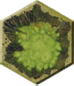
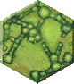
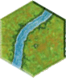
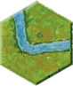
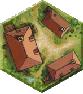
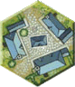
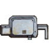
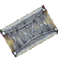
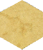
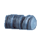

# pyHexBattle

## Memoir'44 Notes

These notes assume you have already read the main `README` file.

### Optional Downloads

For better display, download and install fonts that closely match the originals:

*   [Army](https://fonts2u.com/army.font)
*   [Gunplay](https://www.dafont.com/gunplay.font)

### A Memoir'44 Scenario File

The XML files that store the scenarios are the heart of **pyHexBattle**. An example scenario file looks this:

    <?xml version="1.0"?>
    <hbml:hexbattle 
      id="hill102" 
      type="memoir44" 
      version="1.1" 
      xmlns:hbml="http://www.daysofwonder.com/memoir44/"
      >

      <hbml:meta>
        <hbml:designer id="jw">
          <hbml:name>joewargamer</hbml:name>
          <hbml:email></hbml:email>
          <hbml:website>http://www.boardgamegeek.com/</hbml:website>
        </hbml:designer>
      </hbml:meta>

      <hbml:scenario status="draft" version="1">
        <hbml:name>Hill 102</hbml:name>
        <hbml:alternate></hbml:alternate>
        <hbml:title>(First Day)</hbml:title>
        <hbml:date year="1944" month="6" day="26"/>
        <hbml:period></hbml:period>
        <hbml:location>
          <hbml:country>France</hbml:country>
        </hbml:location>
        <hbml:description>
          Allied and German forces clash at Hill 102 near tributaries of the Loire.
        </hbml:description>
      </hbml:scenario> 

      <hbml:terrain background="standard">  
        <hbml:hex id="4" row="4" col="3" type="terrain" style="hill"></hbml:hex>
        <hbml:hex id="5" row="4" col="4" type="terrain" style="hill">Hill 102</hbml:hex>
        <hbml:hex id="10" row="7" col="12" type="terrain" style="river_straight" face="5">R. Moux</hbml:hex>
        <hbml:hex id="11" row="7" col="13" type="terrain" style="river_straight" face="2"></hbml:hex>
        <hbml:hex id="22" row="4" col="1" type="terrain" style="town">Poin Le Croix</hbml:hex>
        <hbml:hex id="25" row="2" col="6" type="marker" style="bridge" face="1"></hbml:hex>            
        <hbml:hex id="26" row="9" col="10" type="marker" style="allied_wire"></hbml:hex>
        <hbml:hex id="27" row="9" col="11" type="marker" style="allied_hedgehog"></hbml:hex>
        <hbml:hex id="29" row="4" col="2" type="medal" style="allied_medal"></hbml:hex>
        <hbml:hex id="30" row="2" col="8" type="medal" style="german_medal"></hbml:hex>    
      </hbml:terrain>  

      <hbml:forces>

        <hbml:force id="ger" type="german" name="German">
          <hbml:unit id="XT01" type="armour"  row="4" col="2"></hbml:unit>
          <hbml:unit id="XI01" type="infantry" row="2" col="4"></hbml:unit>
          <hbml:unit id="XI02" type="infantry" row="4" col="3"></hbml:unit>
          <hbml:unit id="XA01" type="artillery" row="4" col="9"></hbml:unit>
          <hbml:unit id="XA02" type="artillery" row="5" col="4"></hbml:unit>
          <hbml:special>
            <hbml:instructions>
              <hbml:p>Take 5 command cards.</hbml:p>
              <hbml:p>You move last.</hbml:p>         
            </hbml:instructions>
          </hbml:special>
        </hbml:force>  

        <hbml:force id="all" type="allied" name="Allied">
          <hbml:unit id="AI01" type="infantry" row="1" col="3"></hbml:unit>
          <hbml:unit id="AI02" type="infantry" row="1" col="11"></hbml:unit>
          <hbml:unit id="AI03" type="infantry" row="5" col="1"></hbml:unit>
          <hbml:unit id="AI04" type="infantry" row="6" col="1"></hbml:unit>
          <hbml:unit id="AI05" type="infantry" row="8" col="2"></hbml:unit>
          <hbml:unit id="AI06" type="infantry" row="9" col="3"></hbml:unit>       
          <hbml:unit id="AA01" type="artillery" row="1" col="12"></hbml:unit>
          <hbml:unit id="AA02" type="artillery" row="7" col="2"></hbml:unit>
          <hbml:special>
            <hbml:instructions>
              <hbml:p>Take 4 command cards.</hbml:p>
              <hbml:p>You move first.</hbml:p>
              <hbml:p>Take 2 special cards.</hbml:p>
              <hbml:p></hbml:p>             
            </hbml:instructions>
          </hbml:special>
        </hbml:force>    

      </hbml:forces>

      <hbml:notes>
        <hbml:note id="s" type="special">
          <hbml:p>Hill 102 is worth one medal towards victory to the  side in 
          sole possession of the hill hexes.  No medal is earned if both sides 
          occupy the hill at the game end.  Hill 102 is worth one medal towards 
          victory to the  side in sole possession of the hill hexes.  No medal 
          is earned if both sides occupy the hill at the game end.   
          Rivers are crossable at any hex adjacent to a town. 
    </hbml:p>                    
        </hbml:note>
        <hbml:note id="h" type="historical">
          <hbml:p>It's June 1944: the Allies are poised to invade Hitler's 
          "Fortress Europe". The focal point of their attention is the beaches 
          of Normandy, France.  Nearly a month of landing, attack and counter-
          attack battles are being fought in the French countryside.  This is 
          one such battle...</hbml:p> 
        </hbml:note> 
        <hbml:note id="v" type="victory">
          <hbml:p>Any allied unit occupying a town will count as one medal 
          towards victory. Any German unit occupying the bridge will count as 
          one medal towards victory.</hbml:p>
        </hbml:note>        
      </hbml:notes>    

    </hbml:hexbattle>

A section-by-section explanation of this file now follows.

#### Header Information

    <?xml version="1.0"?>
    <hbml:hexbattle 
      id="hill102" 
      type="memoir44" 
      version="1.1" 
      xmlns:hbml="http://www.daysofwonder.com/memoir44/"
      >

This section is the 'standard' header for an XML file - the only thing that will need to change will be the "id"; this is typically the name of the battle (in lowercase), and should be unique across all battles. For multi-day, or more complex, battles, a longer name might be required e.g. **arnhem-bridge-day1**. The `hbml:` is a prefix which appears in all subsequent tags; it is linked to a unique identifier for this type of XML file that distinguishes it from any other XML file.

#### Meta Information

    <hbml:meta>
        <hbml:designer id="jw">
          <hbml:name>joewargamer</hbml:name>
          <hbml:email></hbml:email>
          <hbml:website>http://www.boardgamegeek.com/</hbml:website>
        </hbml:designer>
    </hbml:meta>
This section contains information on the `<designer>` of the scenario (the person's `<name>` and `<email>` and `<website>`) and which `<version>` of the scenario this particular file represents.

#### Scenario Information

    <hbml:scenario status="draft" version="1">
        <hbml:name>Hill 102</hbml:name>
        <hbml:alternate></hbml:alternate>
        <hbml:title>(First Day)</hbml:title>
        <hbml:date year="1944" month="6" day="26"/>
        <hbml:period></hbml:period>
        <hbml:location>
          <hbml:country>France</hbml:country>
        </hbml:location>
        <hbml:description>
          Allied and German forces clash at Hill 102 near tributaries of the Loire.
        </hbml:description>
    </hbml:scenario> 

This section contains details about the actual battle being represented. The attributes of 'status' can be "draft", "test" or "final", while 'version' is used to indicate earlier and later version that an author may want to track.

The `<name>` is the one conventionally assigned to the battle, while the `<alternate>` lists any other name(s) by which the battle is commonly referred to. The `<title>` is only used when a portion of the battle is being represented by the scenario (as might be the case for larger or longer battle). The `<date>` is when the battle was fought. The `<period>` is used when only a given day of the battle is being simulated. The `<hbml:description>` is brief synopsis of the battle that took place.

The `<location>` is usually the name of the country or area in which the battle took place. Typical names for locations of European battles would be France, Germany, Belgium, Italy or Russia.

#### Terrain and Marker Information

    <hbml:terrain background="standard">  
        <hbml:hex id="4" row="4" col="3" type="terrain" style="hill"></hbml:hex>
        <hbml:hex id="5" row="4" col="4" type="terrain" style="hill">Hill 102</hbml:hex>
        <hbml:hex id="10" row="7" col="12" type="terrain" style="river_straight" face="5">R. Moux</hbml:hex>
        <hbml:hex id="11" row="7" col="13" type="terrain" style="river_straight" face="2"></hbml:hex>
        <hbml:hex id="22" row="4" col="1" type="terrain" style="town">Poin Le Croix</hbml:hex>
        <hbml:hex id="25" row="2" col="6" type="marker" style="bridge" face="1"></hbml:hex>            
        <hbml:hex id="26" row="9" col="10" type="marker" style="allied_wire"></hbml:hex>
        <hbml:hex id="27" row="9" col="11" type="marker" style="allied_hedgehog"></hbml:hex>
        <hbml:hex id="29" row="4" col="2" type="medal" style="allied_medal"></hbml:hex>
        <hbml:hex id="30" row="2" col="8" type="medal" style="german_medal"></hbml:hex>    
    </hbml:terrain>

This section contains a `<hex>` entry for each piece of terrain, obstacle or medal (and other map marking pertinent to the scenario) that appears on the board. Each `<hex>` entry contains:

*   **row**s are numbered from "1" to "9" (starting at the 'top' of the board)
*   **col**umns are numbered from "1" to "13" (starting at the 'left' of the board)
*   **type** is one of: "terrain", "marker" or "medal":

*   for "terrain" type hexes, a **style** property is required to identify which specific terrain is displayed and, in some cases, a **face** property is used as well (to indicate direction). This is a value from 1 to 6 - a "1" indicating a facing to the top hex-point or "north east" hexside. See also the full [Terrain Tile Set](#tileset) list.
*   for "marker" types of hexes, a **style**property is required to identify which specific marker is used. See also the full [Tileset](#tileset) list.
*   for "medal" types of hexes, a **style**property is required to identify which specific medal is used. See also the full [Tileset](#tileset) list.

In addition, the name of the terrain feature (hill, buildings, wood, river and so on), or other notation can be supplied e.g. 'Poin Le Croix' for a town/river label.

**Tip:** In the case where one type of terrain feature has to overlay another - such as is the case for Sandbag placed on, say, a Hill - the overlying terrain `<hex>` entry should occur **after** (below) the entry for the base terrain. All "obstacle" hexes are also usually placed near the end, followed by "medal" hexes, as they typically provide additional annotation that must appear 'over' the underlying terrain.

#### Forces Information

    <hbml:forces>

        <hbml:force id="ger" type="german" name="German">
        ...
          <hbml:special>
            <hbml:instructions>
              <hbml:p>Take 5 command cards.</hbml:p>
              <hbml:p>You move last.</hbml:p>         
            </hbml:instructions>
          </hbml:special>
        </hbml:force>  
        ...
    </hbml:forces>   

This section contains information on the opposing sides in the battle. There will be one `<force>` section for each side. Each `<force>` entry identifies the force:

*   **id** is a unique identifier for each force (the defaults of "ger" for German, or "all" for Allied can be used)
*   **type** _must_ be either "allied" or "german" (this key information is used, for example, to identify corresponding image files)
*   **name** is used for display purposes

Each section also contains detailed force information (see below) as well as `<special>` information applicable to it. This is an `<instructions>` set, such as who it is that starts first.

#### Units Information

    <hbml:unit id="XT01" type="armour"  row="4" col="2"></hbml:unit>
    <hbml:unit id="XI01" type="infantry" row="2" col="4"></hbml:unit>
    <hbml:unit id="XI02" type="infantry" row="4" col="3"></hbml:unit>
    <hbml:unit id="XA01" type="artillery" row="4" col="9"></hbml:unit>
    <hbml:unit id="XA02" type="artillery" row="5" col="4"></hbml:unit>

This section contains the detailed breakdown of a side's playing pieces (units). Each `<unit>` has associated details on:

*   **id** is a unique identifier for each unit in the nbattle; the suggested notation to be used is a four letter code:
    *   A or X - for Allied or Axis (German)
    *   I, T or A - for infantry, armour (tanks) or artillery
    *   A two-digit number (from 01 upwards...)
*   **type** must be one of "infantry", "armour" or "artillery"
*   **row**s are numbered from "1" to "9" (starting at the 'top' of the board)
*   **col**umns are numbered from "1" to "13" (starting at the 'left' of the board)

#### Notes Section

    <hbml:notes>
      <hbml:note id="s" type="special">
        <hbml:p>Hill 102 is worth one medal towards victory to the  side in 
          sole possession of the hill hexes.  No medal is earned if both sides 
          occupy the hill at the game end.  Hill 102 is worth one medal towards 
          victory to the  side in sole possession of the hill hexes.  No medal 
          is earned if both sides occupy the hill at the game end.   
          Rivers are crossable at any hex adjacent to a town.</hbml:p>                    
      </hbml:note>
      <hbml:note id="h" type="historical">
        <hbml:p>It's June 1944: the Allies are poised to invade Hitler's 
          "Fortress Europe". The focal point of their attention is the beaches 
          of Normandy, France.  Nearly a month of landing, attack and counter-
          attack battles are being fought in the French countryside.  This is 
          one such battle...</hbml:p> 
      </hbml:note> 
      <hbml:note id="v" type="victory">
        <hbml:p>Any allied unit occupying a town will count as one medal 
          towards victory. Any German unit occupying the bridge will count as 
          one medal towards victory.</hbml:p>
      </hbml:note>        
    </hbml:notes>  
    
This section can contain three different types of notes. Typically, there will be a `<note>` for "special" rules, as indicated by the "special" type; one for "historical" rules and one for "victory" conditions. Each note can contain a `
`aragraph.

### The XSL "Map Making" Files

A number of XSL (stylesheet) files, each containing different instructions for processing any scenario XML file, are supplied in the `styles` directory.

*   The `battle2colorSVG.xsl` file will, when processed in conjunction with a scenario XML file, create a map layout in SVG, very similar to the conventional layout in the official scenarios.
*   The `battle2text.xsl` file will, when processed in conjunction with a scenario XML file, create a text file, that reproduces the key elements of the scenario in a simple text file, using a hex-numbering scheme to identify locations of forces and terrain.
*   The `battle2HTML.xsl` file will, when processed in conjunction with a scenario XML file, extract some of the key elements of the scenario into a simple HTML file, excluding map layout.
*   The `battle2bwSVG.xsl` file will, when processed in conjunction with a scenario XML file, create a simple map layout in SVG, using markers and standard symbology for units.

### Memoir'44 Resources

</a>

*   [Days of Wonder](http://www.daysofwonder.com/) maintains the [official web site](http://www.memoir44.com)
*   [The BoardGameGeek](http://www.boardgamegeek.com/) has reviews and resources for [Memoir'44](http://www.boardgamegeek.com/viewitem.php3?gameid=10630)

### Terrain and Marker Tile Set

This table summarises all the different types of terrain that can be referenced in an XML scenario file.

<table summary="Terrain Tiles" border="1">

<tbody>

<tr>

<th>Tile</th>

<th>Name</th>

<th>Tile</th>

<th>Name</th>

<th>Tile</th>

<th>Name</th>

</tr>

<tr>

<td></td>

<td>woods</td>

<td></td>

<td>hill</td>

<td></td>

<td>hedgerow</td>

</tr>

<tr>

<td></td>

<td>river_straight</td>

<td></td>

<td>river_curve</td>

<td></td>

<td>lake</td>

</tr>

<tr>

<td></td>

<td>village</td>

<td></td>

<td>town</td>

<td></td>

<td>bunker</td>

</tr>

<tr>

<td></td>

<td>bridge</td>

<td></td>

<td>waves</td>

<td></td>

<td>blank</td>

</tr>

</tbody>

</table>

### Other Game Pieces

This table summarises the different types of game pieces (apart from terrain) that can be referenced in an XML scenario file.

<table summary="Game Pieces" border="1">

<tbody>

<tr>

<th>Piece</th>

<th>Name</th>

<th>Piece</th>

<th>Name</th>

<th>Piece</th>

<th>Name</th>

</tr>

<tr>

<td></td>

<td>allied_wire</td>

<td></td>

<td>allied_hedgehog</td>

<td></td>

<td>allied_sandbag</td>

</tr>

<tr>

<td></td>

<td>german_wire</td>

<td></td>

<td>german_hedgehog</td>

<td></td>

<td>german_sandbag</td>

</tr>

<tr>

<td></td>

<td>allied_medal</td>

<td></td>

<td>german_medal</td>

</tr>

<tr>

<td></td>

<td>br_airborne</td>

<td></td>

<td>ger_special</td>

</tr>

</tbody>

</table>

